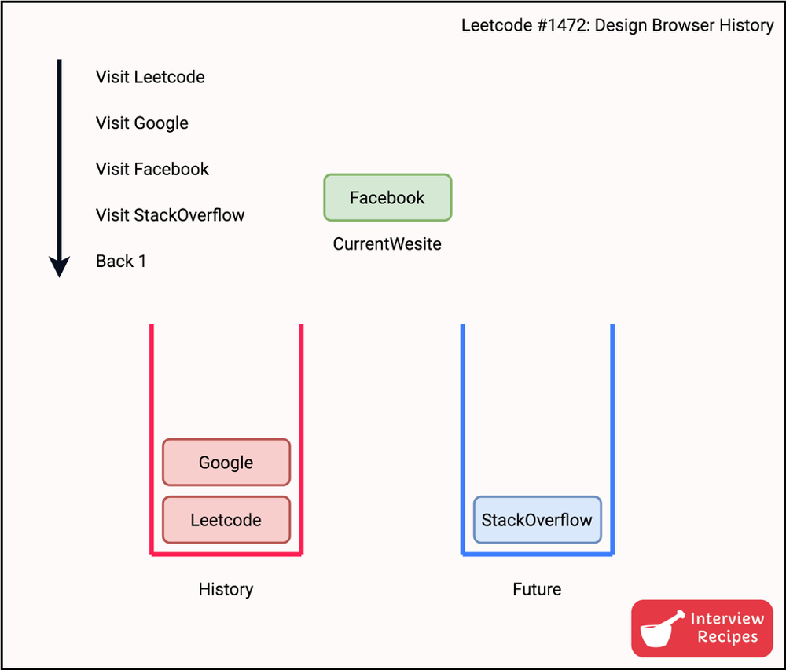

# Design Browser History

LeetCode #1472

**Problem Description**:

You have a browser of one tab where you start on the homepage and you can visit another url, get back in the history number of steps or move forward in the history number of steps.

Implement the BrowserHistory class:

`BrowserHistory(string homepage)`: Initializes the object with the homepage of the browser.

`void visit(string url)`: Visits url from the current page. It clears up all the forward history.

`string back(int steps)`: Move steps back in history. 
                        -> If you can only return x steps in the history and steps > x, you will return only x steps.
                        -> Return the current url after moving back in history at most steps.

`string forward(int steps)`: Move steps forward in history.
                          -> If you can only forward x steps in the history and steps > x, you will forward only x steps.
                          -> Return the current url after forwarding in history at most steps.

<hr>

**Strategy**:

It’s not difficult to realize that we need a stack so that `back()` can be implemented. 

However, what to do for `forward()` ... because you want the ability to visit all pages in the backward as well as the forward direction.
  
  So we need to store the URLs whenever we go back.

  If you see the order in which we want to visit, you will quickly realize that we need TWO STACKS.
    * One stack to store history
    * Second stack to store the next URLs in case we go back.



Two special cases:
You must always have at least one element in the history stack which is the page that you are currently at.
But for the forward stack, this condition is not necessary.

```py
class BrowserHistory:
  def __init__(self, homepage: str):
    self.history = []
    self.future = []
    # history must always have at least 1 element, which should be the page we're currently at
    self.history.append(homepage)

  def visit(self, url: str) -> None:
    # when we visit websites we need to keep track of our history
    self.history.append(url)
    # reset the future stack
    self.future = []

  def back(self, steps: int) -> str:
    # we need to make sure that there's always at least 1 element in the stack
    while steps > 0 and len(self.history) > 1:
      # if we're going back to previous pages, we want to keep track of the pages we were on
      # so we append the last element from history (which is the current page we're at) to future
      self.future.append(self.history[-1])

      # and remove the current page from history, because we're going back x-steps
      self.history.pop()

      # reduce the number of steps after each iteration
      steps -= 1
    # return the page we're left at, after x-steps
    return self.history[-1]

  def forward(self, steps: int) -> str:
    while steps > 0 and self.future:
      # we're visiting new pages, therefore each time we reach a new page - it's the current page and needs to be added to history
      self.history.append(self.future[-1])

      # the list of urls that we previously have visited are being revisited, so we no longer need to track them in the FUTURE stack
      self.future.pop()

      # reduce the number of steps are each iterations
      steps -= 1

    # return the current page we're on, which should always be the top element of the stack
    return self.history[-1]
```

**Time complexity:** visit: O(1), back: O(1), forward: O(1)
**Space Complexity:** O(total all number of pages)

Example Testcase:

input:
["BrowserHistory","visit","visit","visit","back","back","forward","visit","forward","back","back"]
[["leetcode.com"],["google.com"],["facebook.com"],["youtube.com"],[1],[1],[1],["linkedin.com"],[2],[2],[7]]

output:
[null,null,null,null,"facebook.com","google.com","facebook.com",null,"linkedin.com","google.com","leetcode.com"]
