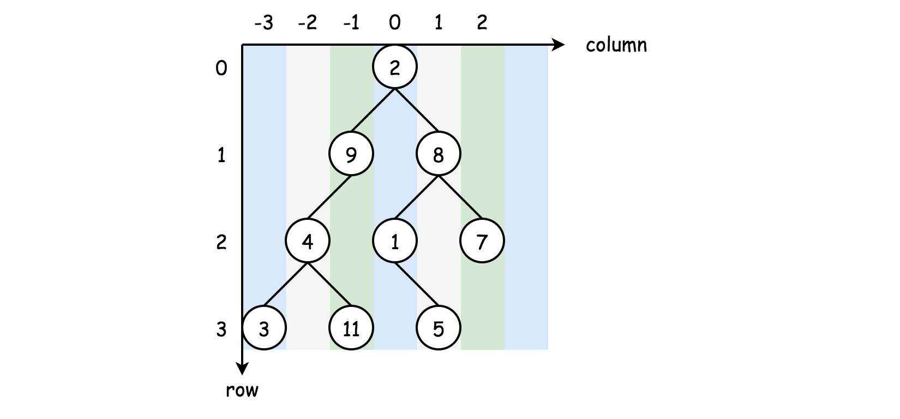
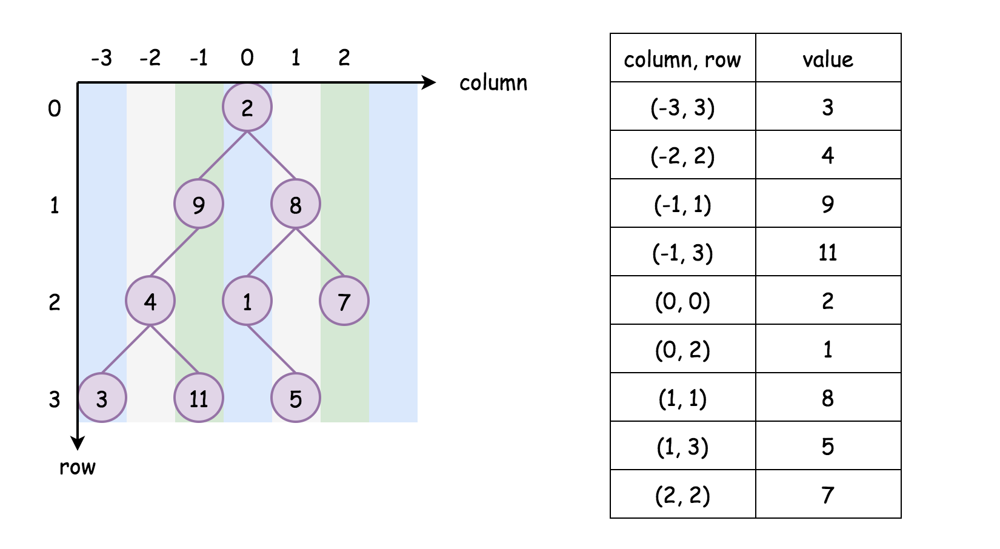

# Binary Tree Vertical Order Traversal

This is yet another problem about Binary Tree traversals. As one would probably know, the common strategies to traverse a Tree data structure are Breadth-First Search (a.k.a BFS) and Depth-First Search (a.k.a. DFS).

The DFS strategy can be further distinguished as preorder DFS, inorder DFS and postorder DFS, depending on the relative order of visit among the node itself and its child nodes.

If one is not familiar with the concepts of BFS and DFS, one can find the corresponding problems on LeetCode to practice with. Also, we have an Explore card called Queue & Stack where we cover both the BFS traversal as well as the DFS traversal. Hence, in this article, we won't repeat ourselves on these concepts.

In the problem description, we are asked to return the vertical order of a binary tree, which actually implies two sub-orders, where each node would have a 2-dimensional index (denoted as <column, row>)

- column-wise order

If we look at a binary tree horizontally, each node can be aligned to a specific column, based on its relative offset to the root node of the tree.

Let us assume that the root node has a column index of 0, then its left child node would have a column index of -1 and its right child node would have a column index of +1, and so on.

- row-wise order

Now if we put the nodes into a vertical dimension, each node would be assigned to a specific row, based on its level (i.e. the vertical distance to the root node).

Let us assume that the root node has a row index of 0, then both its child nodes would have the row index of 1.

> Given the above definitions, we can now formulate the problem as a task to order the nodes based on the 2-dimensional coordinates that we defined above.

More specifically, the nodes should be ordered by column first, and further the nodes on the same column should be ordered vertically based on their row indices.

### Approach 1: Breadth-First Search (BFS)
Intuition

With the formulation of the problem in the overview section, one of the most intuitive solutions to tackle the problem would be applying the BFS traversal, where the nodes would be visited level by level.

With the BFS traversal, we naturally can guarantee the vertical order of the visits, i.e. the nodes at higher levels (large row values) would get visited later than the ones at lower levels.

However, we are still missing the horizontal order ( the column order). To ensure this order, we need to do some additional processing during the BFS traversal.

The idea is that we keep a hash table (let's denote it as columnTable<key, value>), where we keep the node values grouped by the column index.

The key in the hash table would be the column index, and the corresponding value would be a list which contains the values of all the nodes that share the same column index.

In addition, the values in the corresponding list should be ordered by their row indices, which would be guaranteed by the BFS traversal as we mentioned before.

**Algorithm**

We elaborate on the steps to implement the above idea.

- First, we create a hash table named columnTable to keep track of the results.

- As to the BFS traversal, a common code pattern would be to use a queue data structure to keep track of the order we need to visit nodes. We initialize the queue by putting the root node along with its column index value (0).

- We then run the BFS traversal with a loop consuming the elements from the queue.

- At each iteration within the BFS, we pop out an element from the queue. The element consists of a node and its corresponding column index. If the node is not empty, we then populate the columnTable with the value of the node. Subsequently, we then put its child nodes along with their respective column indices (i.e. column-1 and column+1) into the queue.

- At the end of the BFS traversal, we obtain a hash table that contains the desired node values grouped by their column indices. For each group of values, they are further ordered by their row indices.

- We then sort the hash table by its keys, i.e. column index in ascending order. And finally we return the results column by column.

### Approach 2: BFS without Sorting

In the previous approach, it is a pity that the sorting of results overshadows the main part of the algorithm which is the BFS traversal. One might wonder if we have a way to eliminate the need for sorting. And the answer is yes.

> The key insight is that we only need to know the range of the column index (i.e. [min_column, max_column]). Then we can simply iterate through this range to generate the outputs without the need for sorting.

The above insight would work under the condition that there won't be any missing column index in the given range. And the condition always holds, since there won't be any broken branch in a binary tree.

**Algorithm**

To implement this optimization, it suffices to make some small modifications to our previous BFS approach.

During the BFS traversal, we could obtain the range of the column indices, i.e. with the variable of min_column and max_column.

At the end of the BFS traversal, we would then walk through the column range [min_column, max_column] and retrieve the results accordingly.

Animation in Images Folder

### Approach 3: Depth-First Search (DFS)

Although we applied a BFS traversal in both of the previous approaches, it is not impossible to solve the problem with a DFS traversal.

> As we discussed in the overview section, once we assign a 2-dimensional index (i.e. <column, row>) for each node in the binary tree, to output the tree in vertical order is to sort the nodes based on the 2-dimensional index, firstly by column then by row, as shown in the following graph.

Compared to the DFS traversal, the BFS traversal gives us a head start, since the nodes in higher rows would be visited later than the ones in the lower lows. As a result, we only need to focus on the column order.

That being said, we could simply traverse the tree in any DFS order (preorder, inorder or postorder), then we sort the resulting list strictly based on two keys <column, row>, which would give us the same results as the BFS traversal.

> An important note is that two nodes might share the same <column, row>, in the case, as stated in the problem, the order between these two nodes should be from left to right as we did for BFS traversals. As a result, to ensure such a priority, one should make sure to visit the left child node before the right child node during the DFS traversal.

- Here we implement the above algorithm, with the trick that we applied in Approach 2 (BFS without sorting) where we obtained the range of column during the traversal.

- First, we conduct a DFS traversal on the input tree. During the traversal, we would then build a similar columnTable with the column index as the key and the list of (row, val) tuples as the value.

- At the end of the DFS traversal, we iterate through the columnTable via the key of column index. Accordingly, we have a list of (row, val) tuples associated with each key. We then sort this list, based on the row index.

- After the above steps, we would then obtain a list of node values ordered firstly by its column index and then by its row index, which is exactly the the vertical order traversal of binary tree as defined in the problem.
