# Alien Dictionary

This article assumes you already have some confidence with graph algorithms, such as breadth-first search and depth-first searching.
If you're familiar with those, but not with topological sort (the topic tag for this problem), don't panic, as you should still be able to make sense of it.
It is one of the many more advanced algorithms that keen programmers tend to "invent" themselves before realizing it's already a widely known and used algorithm.
There are a couple of approaches to topological sort; Kahn's Algorithm and DFS.

A few things to keep in mind:

- The letters within a word don't tell us anything about the relative order. For example, the presence of the word kitten in the list does not tell us that the letter k is before the letter i.
- The input can contain words followed by their prefix, for example, abcd and then ab. These cases will never result in a valid alphabet (because in a valid alphabet, prefixes are always first). You'll need to make sure your solution detects these cases correctly.
- There can be more than one valid alphabet ordering. It is fine for your algorithm to return any one of them.
- Your output string must contain all unique letters that were within the input list, including those that could be in any position within the ordering. It should not contain any additional letters that were not in the input.

All approaches break the problem into three steps.

1. Extracting dependency rules from the input. For example "A must be before C", "X must be before D", or "E must be before B".
2. Putting the dependency rules into a graph with letters as nodes and dependencies as edges (an adjacency list is best).
3. Topologically sorting the graph nodes.

We encourage you to go and have another go at implementing these steps yourself if you think you now know what to do.
If this all sounded overwhelming and confusing though, don't panic, because we're going to work through it all in detail.

## Approach 1: Breadth-First Search

**Intuition:**

There are three parts to this problem.

1. Getting as much information about the alphabet order as we can out of the input word list.
2. Representing that information in a meaningful way.
3. Assembling a valid alphabet ordering.

### Part 1: Extracting Information

Let's start with a large example of a dictionary in an "alien language", and see how much we can conclude with some simple reasoning.
This is likely to be your first step in tackling this question in a programming interview.

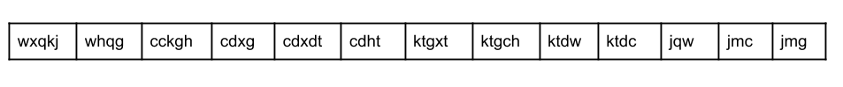

Remember that in an ordinary English dictionary, all the words starting with a are at the start, followed by all the ones starting with `b`, then `c`,`d`,`e`, and at the very end, z. In the "alien dictionary", we also expect the first letters of each word to be in alphabetical order. So, let's look at them.

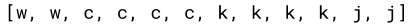

Removing the duplicates, we get:

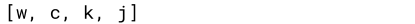

Going by this, we know the relative order of four letters in the "alien dictionary". However, we don't know how these four letters fit in with the other seven letters, or even how those other seven letters fit in with each other. To get more information, we'll need to look further.

Going back to the English dictionary analogy, the word abacus will appear before algorithm. This is because when the first letter of two words is the same, we instead look at the second letter; b and l in this case. b is before l in the alphabet.

Let's take a closer look at the first two words of the "alien dictionary"; wxqkj and whgg. Seeing as the first letters are the same, w, we look at the second letters. The first word has x, and the second word has h. Therefore, we know that x is before h in the alien dictionary. We know have two fragments of the letter-order.

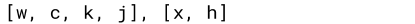

We don't know yet how these two fragments could fit together into a single ordering. For example, we don't know whether `w` is before `x`, or `x` is before `w`, or even whether or not there's enough information available in the input for us to know.

Anyway, we've now gotten all the information we can out of the first two words. All letters after `x` in `wxqkj`, and after `h` in `whqg`, should be ignored because they did not impact the relative ordering of the two words (if you're confused, think back to `abacus` and `algorithm`. Because `b > l`, the `gorithm` and `acus` parts are unimportant for determining alphabetical ordering).

Hopefully, you're starting to see a pattern here. Where two words are adjacent, we need to look for the first difference between them. That difference tells us the relative order between two letters. Let's have a look at all the relations we can find by comparing adjacent words.

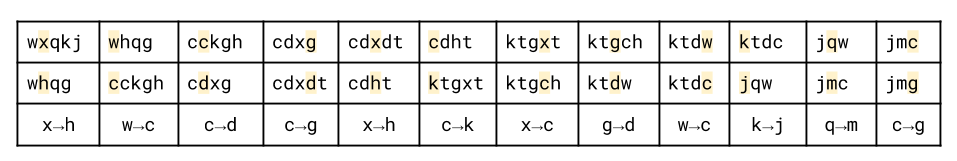

You might notice that we haven't included some rules, such as `w → j`. This is fine though, as we can still derive it from the rules we have: `w → c`, `c → k`, `k → j`.

This completes the first part. There is no further information we can extract from the input. Therefore, our task is now to put together what we know.

### Part 2: Representing the Relations

We now have a set of relations stating how pairs of letters are ordered relative to each other.

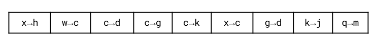

How could we put these together? You may be tempted to start trying to build "chains" out of them. Here are a few possible chains.

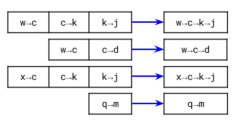

The problem here though is that some letters are in more than one chain. Simply putting the chains into the output list one-after-the-other won't work. Some letters will be duplicated, which invalidates the ordering. Simply deleting the duplicates will not work either.

When we have a set of relations, often drawing a graph is the best way to visualize them. The nodes are the letters, and an edge between two letters, A and B represents that A is before B in the "alien alphabet".

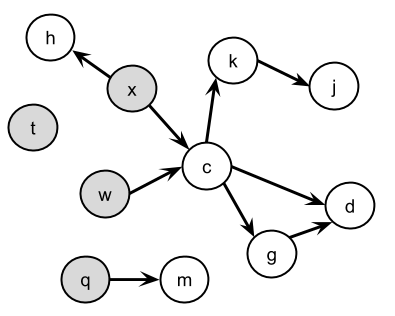

### Part 3: Assembling a Valid Ordering

As we can see from the graph, four of the letters have no arrows going into them.

What this means is that there are no letters that have to be before any of these four (remember that the question states there could be multiple valid orderings, and if there are, then it's fine for us to return any of them).

Therefore, a valid start to the ordering we return would be:

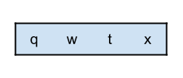

We can now remove these letters and edges from the graph, because any other letters that required them first will now have this requirement satisfied.

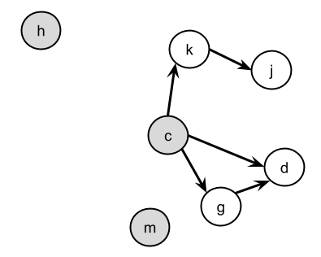

On this new graph, there are now three new letters that have no in-arrows. We can add these to our output list.

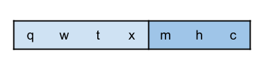

Again, we can remove these from the graph.

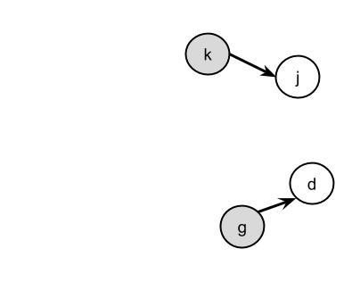

Then add the two new letters with no in-arrows.

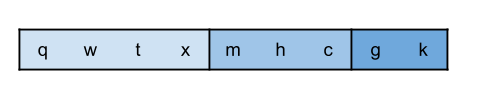

Which leaves the following graph.

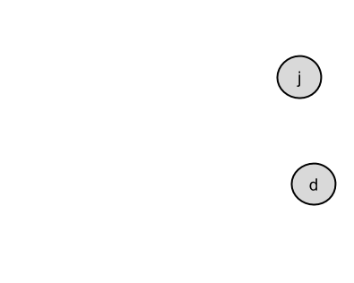

With the final two letters.

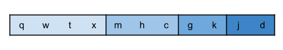

Which is a valid ordering that we can return.

As a side note, each of the four groups of letters we picked off could have been in any order within themselves (as another side note, it's not too difficult to calculate how many valid orderings there are. Have a think about this if you want, determining how many valid alphabet orderings there are is an interesting follow-up question!)

### Algorithm

Now that we have come up with an approach, we need to figure out how to implement it efficiently.

The first and second parts are straightforward; we'll leave you to look at the code for these. It should extract the order relations and then insert them into an **adjacency list**.

The only thing we need to be careful of is ensuring that we've handled the "prefix" edge case correctly.

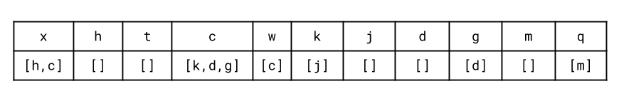

The third part is more complicated. We need to somehow identify which letters have no incoming links left. With the adjacency list format above, this is a bit annoying to do, because determining whether or not a particular letter has any incoming links requires repeatedly checking over the adjacency lists of all the other letters to see whether or not they feature that letter.

A naïve solution would be to do exactly this. While this would be efficient enough with at most 26 letters, it may result in your interviewer quickly telling you that we might want to use the same algorithm on an "alien language" with millions of unique letters.

An alternative is to keep two adjacency lists; one the same as above, and another that is the reverse, showing the incoming links. Then, each time we traverse an edge, we could remove the corresponding edge in the reverse adjacency list. Seeing when a letter has no more incoming links would now be straightforward.

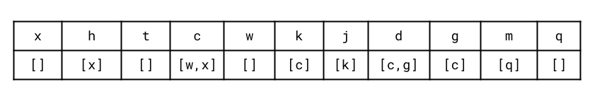

However, we can do even better than that.

Instead of keeping track of all the other letters that must be before a particular letter, we only need to keep track of *how many* of them there are!

While building the forward adjacency list, we can also count up how many incoming edges each letter has. We call the number of incoming edges the **indegree** of a node.

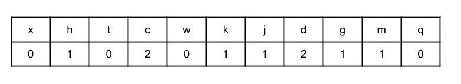

Then, instead of removing an edge from a reverse adjacency list, we can simply decrement the count by 1. Once the count reaches 0, this is equivalent to there being no incoming edges left in the reverse adjacency list.

We'll do a BFS for all letters that are reachable, adding each letter to the output as soon as it's reachable. A letter is reachable once all of the letters that need to be before it have been added to the output. To do a BFS, recall that we use a queue. We should initially put all letters with an in-degree of 0 onto that queue. Each time a letter gets down to an in-degree of 0, it is added to the queue.

We continue this until the queue is empty. After that, we check whether or not all letters were put in the output list. If some are missing, this is because we got to a point where all remaining letters had at least one edge going in; this means there must be a cycle! In that case, we should return "" as per the problem description. Otherwise, we should return the complete ordering we found.

One edge case we need to be careful of is where a word is followed by its own prefix. In these cases, it is impossible to come up with a valid ordering and so we should return "". The best place to detect it is in the loop that compares each adjacent pair of words.

Also, remember that not all letters will necessarily have an edge going into or out of them. These letters can go anywhere in the output. But we need to be careful to not forget about them in our implementation.

## Approach 2: Depth-First Search

**Intuition:**

Another approach to the third part is to use a depth-first search. We still need to extract relations and then generate an adjacency list in the same way as before, but this time we don't need the indegrees map.

Recall that in a depth-first search, nodes are returned once they either have no outgoing links left, or all their outgoing links have been visited. Therefore, the order in which nodes are returned by the depth-first search will be the reverse of a valid alphabet order.

### Algorithm

If we made a reverse adjacency list instead of a forward one, the output order would be correct (without needing to be reversed). Remember that when we reverse the edges of a directed graph, the nodes with no incoming edges became the ones with no outgoing edges. This means that the ones at the start of the alphabet will now be the ones returned first.

One issue we need to be careful of is cycles. In directed graphs, we often detect cycles by using graph coloring. All nodes start as white, and then once they're first visited they become grey, and then once all their outgoing nodes have been fully explored, they become black. We know there is a cycle if we enter a node that is currently grey (it works because all nodes that are currently on the stack are grey. Nodes are changed to black when they are removed from the stack).

There is an animation showing the DFS, starting from a reverse adjacency list of the input in the images folder
