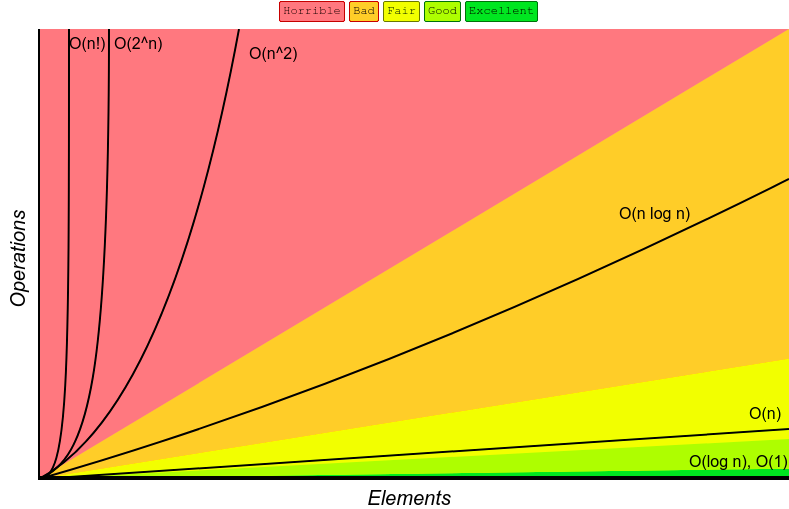
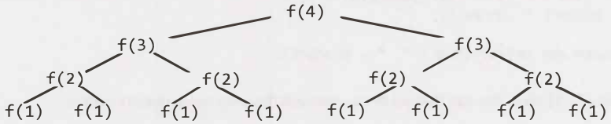
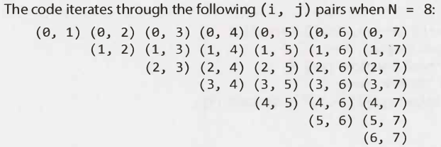

# Know Thy Complexities

|  Data Structure  |  Time Complexity  |
| :--------------: | :---------------: |

|          |  Access  |  Search  |  Insertion  |  Deletion  |  Space Complexity  |
| :------: | :------: | :------: | :---------: | :--------: | :----------------: |
| Array | O(1) | O(n) | O(n) | O(n) | O(n) |
| Stack | O(n) | O(n) | O(1) | O(1) | O(n) |
| Single-linked list | O(n) | O(n) | O(1) | O(1) | O(n) |
| Doubly-linked list | O(n) | O(n) | O(1) | O(1) | O(n) |
| Skip list | O(n) | O(n) | O(n) | O(n) | O(n log(n)) |
| Hash Table | N/A | O(n) | O(n) | O(n) | O(n) |
| Binary Search Tree | O(n) | O(n) | O(n) | O(n) | O(n) |
| Cartesian Tree | N/A | O(n) | O(n) | O(n) | O(n) |
| B-Tree | O(log(n)) | O(log(n)) | O(log(n)) | O(log(n)) | O(n) |
| Red-Black Tree | O(log(n)) | O(log(n)) | O(log(n)) | O(log(n)) | O(n) |
| Splay Tree | N/A | O(log(n)) | O(log(n)) | O(log(n)) | O(n) |
| AVL Tree | O(log(n)) | O(log(n)) | O(log(n)) | O(log(n)) | O(n) |
| KD Tree | O(n) | O(n) | O(n) | O(n) | O(n) |

**Remember:**

- O(1) means constant time
- O(n) means linear time

O(1) the time will be the same no mater what
O(n) the time depends on the size of the data structure passed to us


As you can see `O(n^2)` is much worse than `O(n)`, **but** it is not nearly as bad as `O(2^n)` or `O(n!)`
There are lots of runtimes worse than `O(x!)` too such as `O(n^n)` or `O(2^n * n!)`

Many times our algorithms will have more than 2 steps, but...
How do we know when to **multiply** the runtimes or **add** them?

**Add the Runtimes:** O(A + B)

```java
for (int a : arrA) {
  print(a)
}

for (int b : arrB) {
  print(b);
}
```

We do A chunks of work **then** we do B chunks of work
Therefore, the total amount of work is: `O(A + B)`

**Multiply the Runtimes:** O(A * B)

```java
for (int a: arrA) {
  for (int b: arrB) {
    print(a + "," + b);
  }
}
```

We do B chunks of work **for each** element in A
Therefore, the total amount of work is `O(A * B)`

**In other words:** if your algorithm is in the form:

- "do this, **then**, when you're all done, do that"... then add the runtimes
- "do this **for each time you do that**"... then multiply the runtimes

## Amortized time

Amortized: gradually write off the initial cost of (an asset) over a period

An *ArrayList* or a dynamically resizing array, allows you to have the benefits of an array while offering flexibility in size. You won't run out of space in the ArrayList since its capacity will grow as you insert elements

An arraylist is implemented with an array. When the array hits capacity, the ArrayList class will create a new array with double the capacity and copy all the elements over to the new array

How do you describe the runtime of insertion? This is a tricky question...

The array could be full. If the array contains N elements, then inserting a new element will take O(n) time. 
You will have to create a new array of size `2N` and then copy `N` elements over.
This insertion wil take `O(N)` time

However, we also know that this doesn't happen very often ...
The vast majority of the time insertion will be in O(1) time

We need a **concept** that takes both into account. **This is what amortized time does**
It allows us to describe that, yes, this worst case happens every once in a while. But once it does happen, it won't happen again for so long that the cost is `amortized`.

In this case, what is the amortized time?

As we insert elements, we double the capacity when the size of the array is a power of 2. So after X elements, we double the capacity at array sizes 1,2,4,8,16,...,X. 
That doubling takes, respectively 1,2,4,8,16,32,64,...,X copies.

What is the sum of 1 + 2 + 4 + 8 + 16 + ... + X? If you read this sum left to right it starts with 1 and doubles until it gets to X
**If you read it from right to left**, it starts with X and halves until it gets to 1.
What is the sum of X + x/2 + x/4 + x/8 + ... + 1? This is roughly 2x

Therefore, X insertions takes O(2X) time. The amortized time for each insertion is O(1)

### Log N runtimes

We commonly see O(log N) in runtimes Where does this come from?

Let's use Binary Serach as an example...
In Binary Search, we are looking for an exmaple x in an N-element sorted array

We first compare x to the midpoint of the array.
If x == middle, then we return
If x < middle, then we search the left side of the array
if x > middle, then we search the right soide of the array

for example:
search 9 within {1, 5, 8, 9, 11, 13, 15, 19, 21}
compare 9 to 11 -> smaller
search 9 within {1, 5, 8, 9, 11}
compare 9 to 8 -> bigger
search 9 within {9, 11}
compare 9 to 9
return

We start of with an N-element array to search. Then, after a single step, we're down to `n/2` elements.
One more step, and we're down to `n/4` elements.
We stop when we either find the value or we're down to just 1 element

The total runtime is then a matter of how many steps (dividing N by 2 each time) we can take until N becomes 1.

N = 16 /* divide by 2 */
N = 8 /* divide by 2 */
N = 4 /* divide by 2 */
N = 2 /* divide by 2 */
N = 1 /* divide by 2 */

We could look at this in reverse (going from 1 to 16 instead of 16 to 1). How many times can we multiply 1 by 2 until we get N?

N = 1 /* multiply by 2 */
N = 2 /* multiply by 2 */
N = 4 /* multiply by 2 */
N = 8 /* multiply by 2 */
N = 16 /* multiply by 2 */

What is k in the expression 2^k = N? This is exactly what log expresses.
2^4 = 16 -> log2(16) = 4
log2(N) = k -> 2^k = N

**This is a good take away for you to have**. When you see a problem where the number of elements in the problem space gets halved each time, that will likey be a O(log n) runtime

This is the same reason why finding an element in a balanced binary tree is O(log n). With each comparison, we go either left or right... Half the nodes are on each each, **so we cut the problem space in half each time**

## Recursive Runtimes

```java
int f(int n) {
  if (n <= 1) {
    return 1;
  }

  return f(n - 1) + f(n + 1);
}
```

A lot of people will see the 2 function calls to `f` and jump to O(n^2). This is completely incorrect.

Rather han making assumptions, let's derive the runtime by walking through the code.
Suppose we call `f(4)`.... This calls f(3) twice
Each of those calls to `f(3)` calls `f(2)`, until we get down to `f(1)`

> 
> The tree will have depth N... each node (nodes here represent function calls) have 2 children
> Therefore, each level will have twice as many calls as the one above it
> The number of nodes on each level is:

| Level | # of Nodes | Also Expressed as | Or ... |
| :---: | :---: |  :---: |  :---: |
| 0 | 1 | | 2^0 |
| 1 | 2 | 2 * previous level = 2 | 2^1 |
| 2 | 4 | 2 * previous level = 4 | 2^2 |
| 3 | 8 | 2 * previous level = 8 | 2^3 |
| 4 | 16 | 2 * previous level = 16 | 2^4 |

Therefore, there will be 2^0 + 2^1 + 2^2 + 2^4 + 2^4 + ... 2^N (which is 2N+1 - 1) nodes *(this concept is called power of 2)*

**When you have a recursive function that makes multiple calls, the runtime will often** (but not always) look like O(branches^depth), where the branches is **the number of times each recursive call branches**

In our fibonacci example it is O(2^N) because we call the function `f` 2 times

The space complexity of this algorithm will be O(N)
Although we have O(2^N) nodes in the tree total, only O(N) exist at any given time
Therefore, we would only need to have O(N) memory available

### Examples and Exercises

```java
void foo(int[] array) {
  int sum = 0
  int product = 1;
  for (int i = 0; i < array.length; i++) {
    sum += array[i];
  }
  for (int j = 0; j < array.length; i++) {
    product *= array[i];
  }
  System.out.println(sum + "," + product);
}
```

This will take O(n) time. The fact that we iterate through the array **does not matter**
**If your algorithm is in the form 'do this, then, when you're all done, do that** then add the runtimes
We do A chunks of work **then** we do B chunks of work
We iterate once to calculate `sum` and again to calculate the `product` - doing it twice does not make the runtime `O(n^2)`

```java
void porintPairs(int[] array) {
  for(int i = 0; i < array.legnth; i++) {
    for(int j = 0; j < array.length; i++) {
      System.out.println(array[i] + "," + array[j]);
    }
  }
}
```

The inner for loop has O(n) iterations and it is called N times...therefore, the runtime is O(n^2)

Remember "do this **for each time you do that**"... then multiply the runtimes
For each `i` we run the entire inner for loop
We do `j` chunks of work for each `i`

```java
void porintPairs(int[] array) {
  for(int i = 0; i < array.legnth; i++) {
    for(int j = i + 1; j < array.length; i++) {
      System.out.println(array[i] + "," + array[j]);
    }
  }
}
```

This is very similar code to the above example, but now the inner for-loop starts at `i+1`

We can derive the runtime several ways
> This pattern of for-loop is very common. It's importatnt that you know the runtime
> And that you deeply understand it
> 
*Counting the iterations*
The first time through `j` runs for `N-1` steps.
The second time, it's `N-2` steps.
Then `N-3` steps...and so on
Therefore the number of steps total is:
`(N-1) + (N-2) + (N-3) + ... + 2 + 1`
= 1 + 2 + 3 + ... + N-1
= sum of 1 through N-1

The sum of 1 through `N-1` is N(N-1)/2 **This concept is called `Sum of Integers`** so the runtime will be O(n^2)

#### What It Means

It iterates through **each** pair of values of (i, j) where `j` is bigger than `i`

There are N^2 total pairs. Roughly half of those will have `i < j` and the remaining half will have `i > j`. This code goes through roughly N^2/2 pairs...so it does O(n^2) work.

Visualizing the above explanation:
> 
> This looks like half of an N x N matrix, which has size (roughly) N^2/2. Therefore, takes O(n^2) time

The following code sums the values of all the nodes in a balanced binary search tree. What is its runtime?

```java
int sum(Node node) {
  if (node == null) {
    return 0;
  }
  return sum(node.left) + node.value + sum(node.right);
}
```

**Just because it's a binary search tree doesn't mean that there is a log in it!**
We can look at this two ways

### what is means

The most straightforward way is to think what this means
This code touches each node in the tree once and does a constant time amount of work with each "touch"

Therefore the runtime will be linear in terms of the number of nodes. If there are N nodes. There are N nodes, then the runtime is O(N)

### recursive pattern

We said that the runtime of a recursive function with multiple branches is typically O(branches^depth)
There are two branches at each call, so we're looking at O(2^depth).

At this point many people might **assume** that something went wrong since we have an exponential algorithm--that something in our logic is flawed or that we've inadvertently created an exponential algorithm

The second statement is correct. We do have an exponential time algorithm, but it's not as bad as one might think. Consider what variable it's exponential with respect to...

What is depth? The tree is a balanced binary search tree. Therefore, if there are N total nodes, then the depth is roughly `log N`

By the equation above, we get O(2^log(n))...
Recall what log2 means:
`2^p = Q -> log2(Q) = P`
What is 2^logN? There is a relationship between 2 and log, so we should be able to simplify this.

Let P = 2log(n). By the definition of log2, we can write this as log2(P) = log2(N). This means that P = N.

Let P = 2^log(N)
-> log2(P) = log2(N)
-> P = N
-> 2^log(n) = N

Therefore, the runtime of this code is O(N), here N is the number of nodes

The folowing code prints all Fibonacci numbers from 0 to n. However, this time, it stores (caches) previously computed values in an integer array.
If it has already been computed, it just returns the cache.

```java
void allFib(int n) {
  int[] memo = new int[n+1];
  for (int i = 0; i < n; i++) {
    System.out.println(i + ": " + fib(i, memo));
  }
}

int fib(int n. int[] memo) {
  if (n <= 0) return 0;
  else if (n == 1) return 1;
  else if (memo[n] > 0) return memo[n];
  
  memo[n] = fib(n-1, memo) + fib(n-2, memo);
  return memo[n]
}
```

Let's walk through what this algorithm does:

```
fib(1) -> return 1
fib(2)
...fib(1) -> return 1
...fib(2) -> return 0
...store 1 at memo1
fib(3)
...fib(2) -> lookup memo[2] -> return 1
...fib(1) -> return 1
...store 2 at memo[3]
fib(4)
...fib(3) -> lookup memo[3] -> return 2
...fib(2) -> lookup memo[2] -> return 1
...store 3 at memo[4]
fib(5)
...fib(4) -> lookup memo[4] -> return 3
...fib(3) -> lookup memo(3) -> return 2
...store 5 at memo[5]
```

At each call to `fib(1)`, we have already computed and stored the values for `fib(i-1) and fib(i-2)`.
We just look up those values, sum them, store the new result, and return.
This takes a constant amount of time.

We're doing a constant amount of work N times, so this is O(n) time.

This **technique** is called **memoization**, is a very common one to optimize exponential time recursive algorithm.
