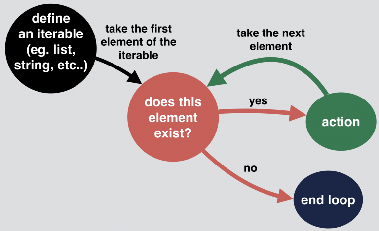

# How to loop with indexes in Python

## For loops in other languauges

```js
var colors = ['red','green','blue','purple']

for (var i=0; i < colors.length; i++){
  console.log(colors[i])
}
```

This Javascript loop looks nearly identical in C/C++ and Java
In this loop we:

- Set a counter variable `i` to 0
- Check if the counter is less than the array length
- Execute the code in the loop or exit the loop if the counter is too high
- Increment the counter variable by 1

## Looping with Python

### while

If we wanted to mimic the behavior of our **traditional** C-style `for` loop in Python, we could use a `while` loop:

```python
colors = ['red','green','blue','purple']
i=0
while i < len(colors):
  print(colors[i])
  i += 1
```

This involves the same 4 steps as the `for` loop in other languages

1. declaring the for loop
2. setting the counter `i`
3. checking the `i`
4. incrementing `i`
**However, this method of looping in Python is very uncommon**

> This is the underlying logic of Python for loops
>

### range of length

We can attempt to recreate traditional `for` loops in a slightly more creative fashion in python:

```python
colors = ['red','green','blue','purple']
for i in range(len(colors)):
  print(colors[i])

range(n): generates a set of whole numbers starting from 0 to n-1
For example: range(8) is equivalent to [0,1,2,3,4,5,6,7]

range(start, stop): generates a set of whole numbers starting from start to stop-1
For example: range(5,9) is equivalent to [5,6,7,8]

range(start, stop, step_size): the default step size is 1...which is why when we did not specify the step_size, the numbers generated have a difference of 1
However by specifying the step size we can generate the numbers having the difference of step_size

For example: range(1,10,2) is equivalent to [1,3,5,7,9]


```

This first creates a range corresponding to the indexes in our list
(`0` to `len(colors)-1`)
We can loop over this range using python's for-in loop
*This is Python's equivalent of a for-each loop*

## for-in: the usual way

Both the while-loop and range-of-len methods **rely** on looping over indexes.
But we don't actually care about the indexes
**we're only using these indexes for the purposes of retrieving elements from our list**

Because we don't actually care about the indexes in our loop, there is a **much simpler method of looping we can use**

```python
colors = ['red','green','blue','purple']
for color in colors:
  print(color)
```

### What if we need indexes

For example, let's say we're printing out president names along with their numbers (based on indexes)

```python
presidents = ["Washington", "Adams", "Jefferson", "Madison", "Monroe", "Adams", "Jackson"]
for president in range(len(presidents)):
  print("President {}: {}".format(i+1, presidents[i]))
```

But there's an easier way to accomplish this task: use the `enumerate` function

### enumerate

Python's built-in `enumerate` function allows us to ***loop over a list*** **and** ***retrieve both the index and the value of each item in the list***

```python
presidents = ["Washington", "Adams", "Jefferson", "Madison", "Monroe", "Adams", "Jackson"]
for num, name in enumerate(presidents, start=1):
  print("President {}: {}".format(num, name))
```

The `enumerate` function gives us an iterable where each element is a **tuple** that contains the index of the item and the original item value

The function is meant for solving the task of:

1. Accesing each item in a list (or another iterable)
2. Also getting the index of each item accessed

So whenever we need item indexes while looping, we should think of `enumerate`

**Note:** the `start=1` option to `enumerate` here is optional. If we didn't specify this, we'd start counting at `0` by default

### What if we need to loop over multiple things

Often when we use list indexes, it's to look something up in another list

#### enumerate

For enumerate, here we're looking over two lists at the same time using indexes to look up corresponding elements:

```python
colors = ["red", "green", "blue", "purple"]
ratios = [0.2, 0.3, 0.1, 0.4]
for i, color in enumerate(colors):
  ratio = ratios[i]
  print("{}% {}".format(ratio * 100, color))
```

Note that we only need the index in this scenario because we're using it to lookup elements at the same index in our second list.
**What we realy want is to loop over two lists simultaneously: the indexes just provide a means to do that**

#### zip

We don't actually care about the index when looping here.
Our real goal is to **loop over two lists at once**
This need is common enough that there's a special built-in function just for this

Python's `zip` function allows us to **loop over multiple lists at the same time**

```python
colors = ["red", "green", "blue", "purple"]
ratios = [0.2, 0.3, 0.1, 0.4]
for color, ratio in zip(colors, ratios):
  print("{}% {}".format(ratio * 100, color))
```

The `zip` function takes multiple lists and returns an iterable that provides a tuple of the corresponding elements of each list as we loop over it

Note that `zip` with different size lists will stop after the shortest list runs out of items
`zip` in Python 2 returns a **list**
`zip` in Python 3 returns a **laxy iterable**

### Looping cheat sheet

Here's a very short looping cheat sheet that might help you remember the preferred construct for each of these 3 looping scenarios

> **Loop over a single list with a regular for-in**
> for n in numbers:
> print(n)

> **Loop over multiple lists at the same time with** `zip`:
> for header, rows in zip(headers, columns):
> print("{}: {}".format(num, line))

> **Loop over a list while keeping track of indexes with** `enumerate`:
> for num, line in enumerate(lines):
> print("{0:03d}: {}".format(num, line))

## In Summary

If you find yourself tempted to use `range(len(my_list))` or a loop counter, think about whether you can reframe your problem to allow usage of `zip` or `enumerate` (or a combination of the two)

In fact, if you find youself reaching for `enumerate`, think about whether you actually need indexes at all. It's quite rare to need indexes in python

1. If you need to loop over multiple lists at the same time, use `zip`
2. If you only need to loop over a single list just use a `for-in` loop
3. If you need to loop over a list and you need item indexes, use `enumerate`
